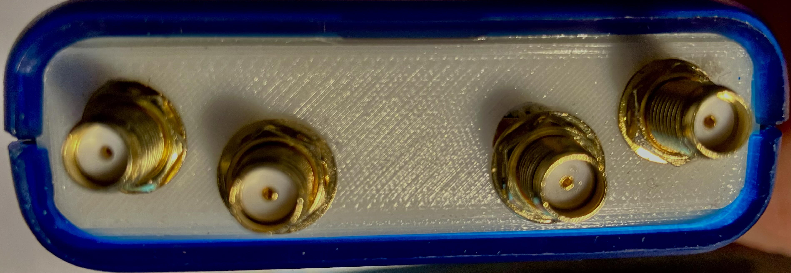

# pluto-front-pannel

The repository  contains 3d model of the front pannel ready to be print on 3d printer and use on pluto device receiver. It can be further customized with drill base on needs.
[Link to file](./plutoFront2.stl) You can as well view a 3d model base on clik.

 

